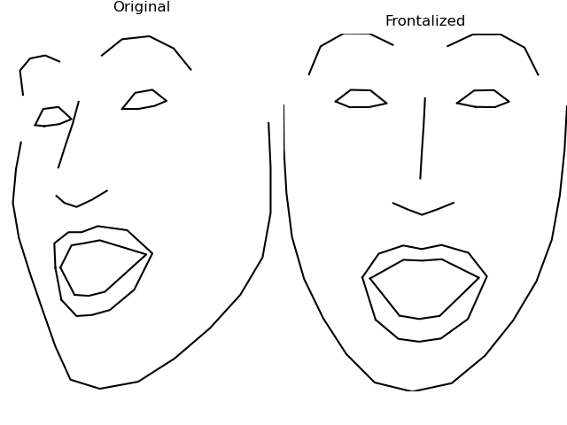

# Facial landmark frontalization for DLIB
Simple function to **frontalize** non-frontal 2D facial landmarks, generated by the **DLIB** library.





# Usage
The function should work directly "out of the box". Frontalization weighs have been learnt and are provided. However, there is also training code in order to retrain with your own data, if needed. 
1. Detect faces and landmarks using DLIB.
2. Pass the landmarks object to the frontalization function ```frontalize_landmarks(landmarks, frontalization weights)```
3. Get back a numpy array of the frontalized landmarks.


# Contents:
```tree
│   environment_requirements.txt                [Environment file for the required version of libraries]
├── source                                      [Directory: Source code]
│   ├── estimate_mean_face.py                   [Script to estimate mean face from the whole dataset. Required for training] 
│   ├── fill_matrices.py                        [Script to fill matrices and learn the frontalization weights from the dataset]
│   ├── utils.py                                [Collection of helpful functions, including the frontalization function]
│   ├── example_frontalize_dlib_singleimage.py  [Example of applying frontalization on faces from a single image]
│   └── example_frontalize_dlib_camera.py       [Example of applying real-time frontalization on faces from a camera]
└── data                                        [Directory: data, models and sample test images]
    ├── landmark_dataset.csv                    [Dataset of anonymized landmarks with many subjects, headposes and expressions]
    ├── frontalization_weights.npy              [Pre-learnt weights used for the frontalization function]
    ├── landmarks_mean_face.npy                 [Pre-learnt mean face used for the frontalization function] 
    ├── shape_predictor_68_face_landmarks.dat   [DLIB facial landmark model] 
    ├── faces.jpg                               [Example test image] 
    └── demo.gif                                [Example gif showing real-time frontalization] 
```


# Dependences
- dlib
- opencv
- numpy
- imageio
- matplotlib


# Citation
If you use this code in your research please cite the following paper:   
1. [V. Vonikakis, S. Winkler. (2020). Identity Invariant Facial Landmark Frontalization for Facial Expression Analysis. Proc. ICIP2020, Abu Dhabi, October 2020.](https://stefan.winkler.site/Publications/icip2020a.pdf)
